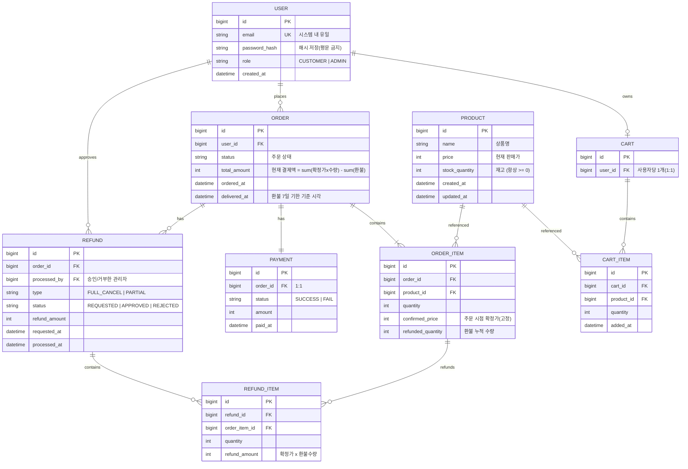
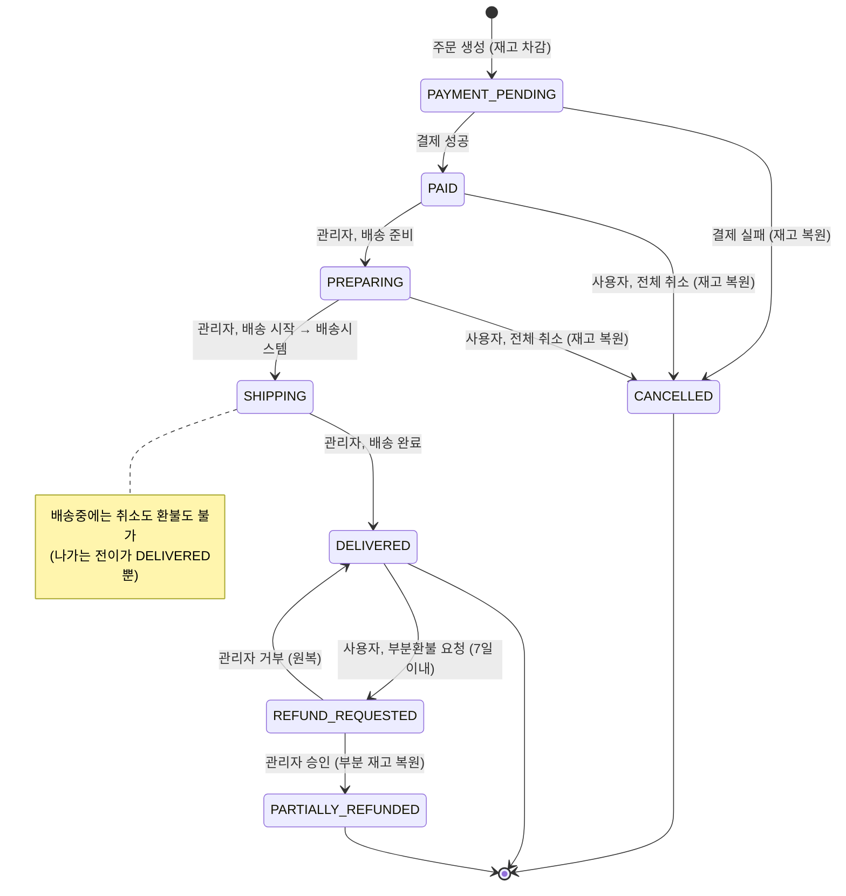
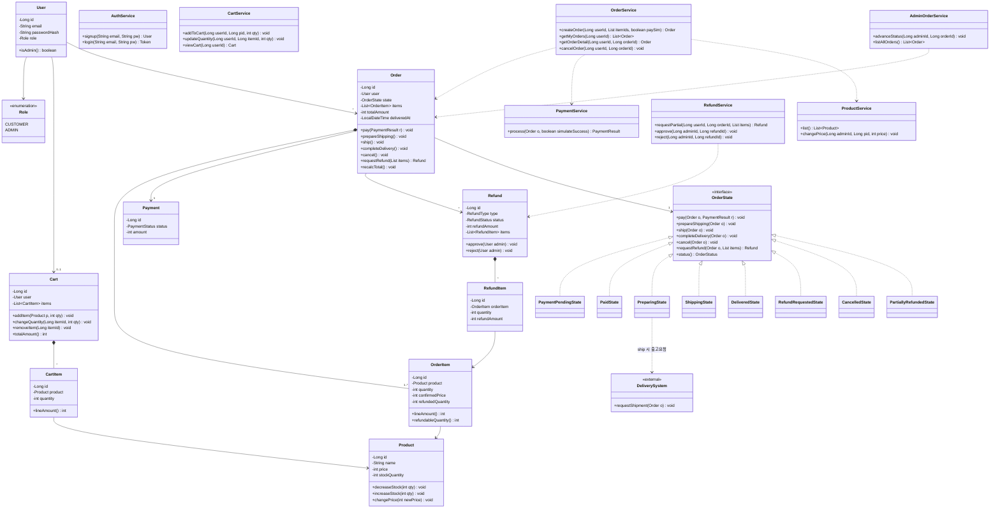
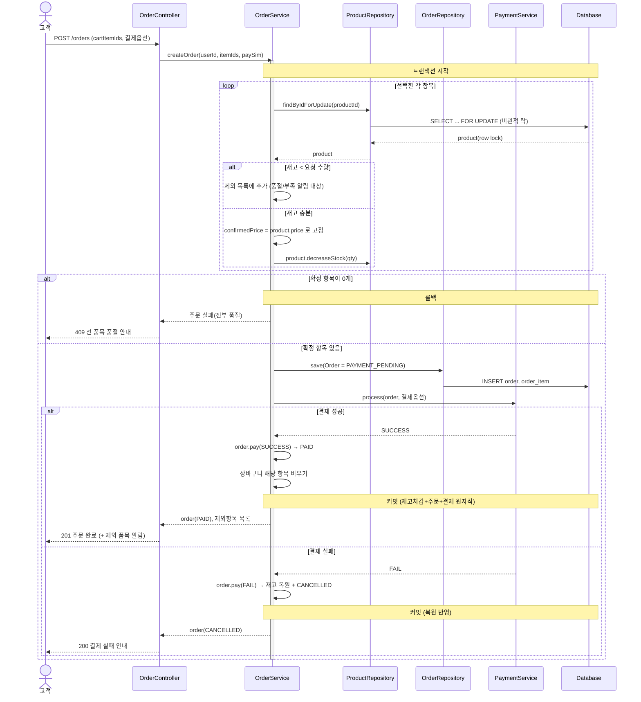
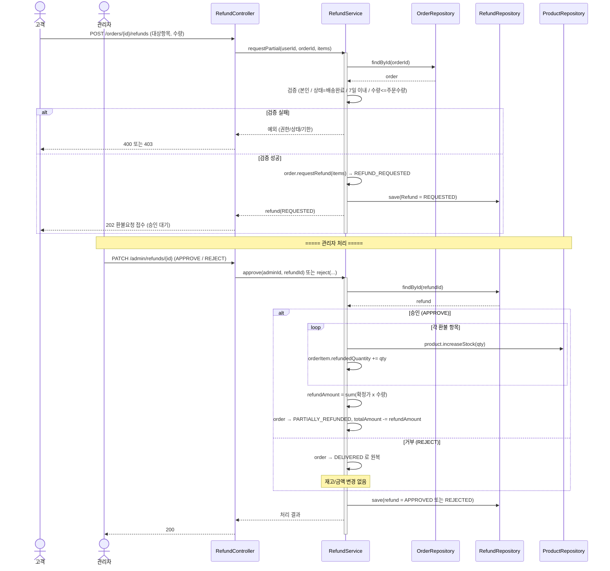

# 쇼핑몰 시스템 설계 문서 (정재 담당분)

> 범위: **클래스 다이어그램 · 시퀀스 다이어그램 · ERD** (+ 주문 상태 머신)
> 기준: 팀 요구사항 명세서(최종본). "무엇을"(요구사항) → "어떻게"(설계) 매핑.

---

## 1. 핵심 설계 결정 (Design Decisions)

요구사항에서 까다로운 지점들을 어떤 메커니즘으로 풀었는지 정리합니다. 다이어그램은 이 결정들을 시각화한 결과물입니다.

1. **주문 생명주기 = State 패턴.**
   상태 전이가 "단방향(역행 불가)"이고, 상태별로 가능한 동작(취소/환불)이 엄격히 다릅니다. `if(status == ...)` 분기를 서비스에 흩뿌리면 정합성이 깨지기 쉬워, 상태 자체를 객체(`OrderState`)로 만들어 **허용되지 않는 전이는 메서드 자체가 예외를 던지도록** 했습니다. (예: `ShippingState`에는 cancel/requestRefund 전이가 아예 없음)

2. **재고 동시성 = 비관적 락(SELECT ... FOR UPDATE) + 트랜잭션.**
   요구사항이 명시적으로 "DB 수준의 락 또는 트랜잭션"을 요구합니다. 충돌 빈도가 높은 재고 차감에는 낙관적 락(재시도 비용)보다 비관적 락이 안전합니다. 주문 항목별로 상품 row에 락을 걸고 → 재고 검증 → 차감 → 주문 생성을 **하나의 트랜잭션**으로 묶어 원자성을 보장합니다.

3. **가격 고정 = `OrderItem.confirmedPrice` 분리.**
   "주문 확정 가격은 이후 상품 가격이 바뀌어도 변하지 않는다"를 만족하려면, 주문 시점 가격을 `OrderItem`에 **스냅샷**으로 복사해야 합니다. 관리자의 가격 변경은 `Product.price`만 바꾸므로 기존 주문에 영향이 없습니다.

4. **장바구니는 가격 스냅샷을 보관하지 않음.**
   "장바구니에 담은 뒤 가격이 변경되면 장바구니 가격도 자연스럽게 바뀐다"가 최종 요구사항입니다. 따라서 `CartItem`은 수량만 갖고, 가격은 항상 `Product.price`를 참조합니다. 가격이 고정되는 시점은 **오직 주문 생성 시**입니다.

5. **환불 워크플로우 = 전체 취소(즉시) vs 부분 환불(승인 대기) 분리.**
   - 전체 취소: `결제완료`/`배송준비`에서만, **관리자 승인 없이 즉시** → 재고 복원, `취소완료`.
   - 부분 환불: `배송완료`에서만(7일 이내), **`환불요청` 상태로 대기** → 관리자 승인 시 부분 재고 복원 + `부분환불`, 거부 시 `배송완료`로 원복.
   두 경우 모두 `Refund` 엔티티로 기록하되 `type`으로 구분합니다.

6. **배송 시스템 = 외부 시스템(EIF).**
   `배송준비 → 배송중` 전이 시 외부 `DeliverySystem`에 출고 요청. 우리 시스템 경계 밖이라 클래스/시퀀스에서 `<<external>>`로 표기.

### ⚠️ 팀과 확인이 필요한 지점 (소연/태건에게)
- **`환불요청`을 "주문 상태"로 둘지** — 원래 enum 목록(`결제대기/결제완료/배송준비/배송중/배송완료/취소완료/부분환불`)엔 없지만, "거부 시 직전 상태(배송완료)로 복귀한다"는 문구는 주문이 `환불요청` 상태로 한 번 들어갔다 나온다는 의미라, 저는 **주문 상태에 `환불요청`을 추가**했습니다. (대안: 주문은 `배송완료` 유지하고 환불 상태만 별도 추적)
- **결제 시점 일부 품절 처리** — 장바구니 섹션("품절 항목 제외 후 알림")과 주문 섹션("재고 한도 내 성공/초과분 실패")이 미묘하게 다릅니다. 저는 **재고 부족 항목은 주문에서 제외 + 알림, 나머지는 정상 진행**(전부 제외되면 주문 실패)으로 통일했습니다.
- `재환불 불가`/`refundedQuantity`는 최종 스코프에서 빠졌지만(취소선), 정합성을 위해 필드는 남겨뒀습니다. 뺄지 결정 필요.

---

## 2. ERD

**제약/정합성 메모**
- `CART_ITEM(cart_id, product_id)` 복합 UNIQUE → 동일 상품 중복 담기 방지(수량으로만 증가).
- `stock_quantity >= 0` CHECK 제약.
- 전체 취소는 `REFUND(type=FULL_CANCEL, status=APPROVED)` 한 건으로 즉시 기록(개별 REFUND_ITEM 생략 가능).

---

## 3. 주문 상태 머신 (State Diagram)

State 패턴이 강제하는 전이 규칙을 그림으로. 화살표에 없는 전이는 **불가능**(메서드가 예외).

> 한글 상태 매핑: PAYMENT_PENDING=결제대기, PAID=결제완료, PREPARING=배송준비, SHIPPING=배송중, DELIVERED=배송완료, REFUND_REQUESTED=환불요청, CANCELLED=취소완료, PARTIALLY_REFUNDED=부분환불

---

## 4. 클래스 다이어그램

레이어드 구조(Controller → Service → Repository → Domain) 중 **도메인 + State 패턴 + 핵심 서비스**를 표현합니다. (Spring Bean은 기본 싱글톤 → 비기능 요구사항의 "Singleton" 충족)

**패턴 요약**
- **State**: `Order`는 동작을 현재 `OrderState`에 위임. 상태 클래스가 허용 전이만 구현 → 잘못된 전이는 예외.
- **Facade**: `OrderService`가 재고(`ProductService`)·결제(`PaymentService`)·주문 생성을 한 트랜잭션으로 조율.
- **Singleton**: 모든 Service/Repository는 Spring Bean(싱글톤).

---

## 5. 시퀀스 다이어그램

### 5-1. 주문 생성 + 결제 (재고 동시성 / 결제 성공·실패)

### 5-2. 부분 환불 요청 → 관리자 승인/거부

> **전체 취소**(결제완료/배송준비 → 취소완료)는 위 부분환불과 흐름이 유사하나 **관리자 승인 단계가 없고**(즉시), 모든 항목 재고를 복원합니다. 상태 머신(3장)에 전이가 표현돼 있어 별도 시퀀스는 생략했습니다.

---

## 6. 요구사항 → 설계 추적표 (Traceability)

| 요구사항 | 설계 반영 |
|---|---|
| 이메일 유일 / 비밀번호 해시 | `USER.email` UNIQUE, `password_hash` |
| 역할(일반/관리자), 가입은 항상 일반 | `Role` enum, 관리자는 시드 데이터, `AuthService` |
| 재고 동시성(초과 판매 방지) | `findByIdForUpdate` = SELECT FOR UPDATE + 단일 트랜잭션 |
| 재고 항상 0 이상 | `Product.decreaseStock` 검증 + DB CHECK |
| 항목 가격 고정 | `OrderItem.confirmedPrice` 스냅샷 |
| 가격 변경이 기존 주문에 무영향 | `Product.price`만 변경, `confirmedPrice` 불변 |
| 장바구니는 현재가 반영 | `CartItem`에 가격 미보관, `Product.price` 참조 |
| 결제 mock / 실패 시 재고 복원 | `PaymentService.process`, 실패 시 `increaseStock` + `CANCELLED` |
| 상태 단방향 전이 | State 패턴, 상태 머신 다이어그램 |
| 전체 취소 즉시 처리 | `Order.cancel()` — PAID/PREPARING에서만 |
| 부분 환불 승인 대기 | `Refund(REQUESTED)` → 관리자 approve/reject |
| 7일 환불 기한 | `Order.deliveredAt` + 검증 |
| 배송중 취소/환불 불가 | `ShippingState`에 해당 전이 없음 |
| 본인 주문만 조회/조작 | `OrderService` 소유자 검증 |
| 외부 배송 시스템 | `DeliverySystem` `<<external>>` (EIF) |
| 총액 정합성 | `total_amount = Σ(확정가×수량) − Σ(환불액)` |
